# MiniChess

A simple chess program written by C#. You can play with your friend locally, or use it to gennerate a endgame to practice.

- Move: Generally when you click a piece you get its highlighted place that it's allowed to move to; And to move, just click the place you want.White goes first, and then black does.
- Promotion: Scroll mouse wheel on the place where you've promoted to choose the piece you want.
- Rotation: Scroll mouse wheel on the center of the board to rotate the whole board.
- Edit: hit SPACE 5 times and you'll get the ability to remove/add a piece by using mouse middle click.Once you create a piece(should be a Pawn), you can scroll mouse wheel on it right away to change to another piece.You can even have two kings or more!

## 设计简介

### 系统总体设计

- 本程序实现了一个西洋棋（或国际象棋）的界面与操作。

- ClassBoard类继承Form，承担图形界面的对接，由用户点击事件驱动游戏的进行。

- 点击后将调用到ChessPiece类中的一些方法计算移动路径。

### 系统功能设计

本程序可供两人本地对弈，亦可自己进行残局练习。

<center><strong>表 1  系统功能 </strong></center>

| 功能 | 简介                                                         |
| ---- | ------------------------------------------------------------ |
| 动子 | 点击一个棋子，系统将计算其合法移动路径；再点击高亮的格子即可移动。白棋先走，然后轮流动子。 |
| 升变 | 兵升变后可以在那个位置通过鼠标滚轮选择变成的棋子。           |
| 旋转 | 如果需要旋转棋盘，在棋盘中央滑动鼠标滚轮即可。               |
| 编辑 | 若需要上帝模式手动编辑棋子，只需连击空格5次，然后就可以用鼠标中键移除/添加棋子，同样利用滚轮选子。通过此特性可以方便地创造一个指定残局，甚至拥有多个王（规则：一个王被将死即算输） |

### 类的设计

包括所有类的设计、各个类之间的关系和主要成员函数的设计等。建议采用合适的方式(如，框图或表格)来表示类的设计和主要成员函数的功能；要求以图示方式来表示各个类之间的关系；对于关键和主要的成员函数，要求以程序流程图来表达其实现过程，同时可以适当粘贴关键代码进行说明；

#### ChessBoard

- 重要成员变量：
- 棋格集 `Panel[,] chessPanels`， 棋子集 `List<ChessPiece> chessPieces` ， 可移动区`List<Point> potentialMoves` ， 是否白棋回合`bool whiteTurn ` ， 选中的棋子`ChessPiece selectedPiece`

- `private void Form1_Load(object sender, EventArgs e)` 打开窗口时执行。创建每个格子的panel，并存放于chessPanels。会调用`void setUpBoard()`，初始化各个棋子。
- `void redrawBoard(bool forceClear=false)` 绘制界面，包括棋盘与棋子。若`forceClear==ture` 将先清除各个panel的图像。
- `void panelClick(object sender, MouseEventArgs e` panel的mouseclick订阅的方法。具体见下面的流程图。
- `void movePiece(Point panelLocation)` 受panelClick调用。移动selectedPiece至指定位置。此方法的执行完毕意味着一个回合的结束。此方法也会检查一些特殊情况，如升变，王车易位，吃过路兵
- `void endGameIfNecessary()` 受movePiece调用。判断是否到了结束游戏的时候。如果一方没有子可动，进一步判断，如果王被将意味着被checkmate，胜负已定；若王安全则平局。
- `ChessPiece findChessPiece(Point location)` 工具方法，得到指定位置的棋子
- `Panel findPanelByLocation(Point location)` 工具方法，得到一个位置的panel
- `Point findLocationByPanel(Panel panel)` 得到一格panel的位置
- 还有一些方法提供了一些小功能，比如给一些格的MouseWheel订阅一些方法使其可以通过滚轮滑动改变棋子或棋局。上面的findPanelByLocation 和 findLocationByPanel 实际上会根据当前指定方向进行图形输出时的旋转。

#### ChessPiece

- 抽象类。

- 包含成员变量Color，Location，LocationLast，possibleMoves，Image，hasMoved。分别表示：颜色，位置，上一步位置，可移动区域，对应图像，是否已移动过。

- 包含构造方法，继承于此的棋子通常在构造方法上增加了Image的设置。

- 为了能深拷贝，实现了Clone()。用到的地方：计算可移动区域时，需要减去会导致王被将到的位置，模拟此过程需要创建一个虚拟棋子集，会用到拷贝。

- 方法`bool isChecked(List<ChessPiece> chessPieces, Point kingPoint, bool isWhite)`用于检查一个位置是否被将。

- 方法`void removeImposssibleMoves(List<ChessPiece> chessPieces)`移除possibleMoves中会导致王被将到的位置。

- 方法`virtual List<Point> CalculateMoves(List<ChessPiece> chessPieces)` 交由每个具体棋子去覆盖，用处为根据规则增加各自可移动位置到possibleMoves。

- 方法 `virtual List<Point> addExtraMoves(List<ChessPiece> chessPieces)` 用于特殊移动的增加到possibleMoves，如王车易位，吃过路兵

- 方法 `void canMoveHorizontally(List<ChessPiece> chessPieces)` 用于向possibleMoves中加入十字经过的格子。在每个方向上检查，如果路径上是空格就继续延伸，直到碰到棋子，如果改棋子是对方的则也增加这个位置。

- 方法`void canMoveDiagonally(List<ChessPiece> chessPieces)` 用于向possibleMoves中加入X字经过的格子。思路同上。

- 方法 `List<Point> CalculateMovesWithKingConsidered(List<ChessPiece> chessPieces)`是被ChessBoard里panelClick真正调用的返回合法移动区域的方法。

  ```csharp
  public List<Point> CalculateMovesWithKingConsidered(List<ChessPiece> chessPieces) {
      CalculateMoves(chessPieces);
      addExtraMoves(chessPieces);
      removeImposssibleMoves(chessPieces);
      return possibleMoves;
  }
  ```

  

+ 下面是继承于此的棋子类

##### Pawn

- 兵

- `override List<Point> CalculateMoves(List<ChessPiece> chessPieces)` 包含：直走2格（如果没动过）或1格，如果斜线一格有对方棋子则可斜走一格
- `override List<Point> addExtraMoves(List<ChessPiece> chessPieces)` 包含：吃过路兵，判断自己的位置和左右有没有对方刚动过且第一次的兵

##### Rook

- 车
- 计算路径只需要调用`canMoveHorizontally`

##### Knight

- 马
- 计算路径，就是走日字

##### Bishop

- 象
- 计算路径只需要调用`canMoveDiagonally`

##### Queen

- 后
- 计算路径只需要调用`canMoveHorizontally` + `canMoveDiagonally`

##### King

- 王
- `override List<Point> CalculateMoves(List<ChessPiece> chessPieces)` 包含：八个方向走一格
- `override List<Point> addExtraMoves(List<ChessPiece> chessPieces)` 包含：王车易位，判断自己和两边对应车有没有移动过，位置，路径中有没有被将。


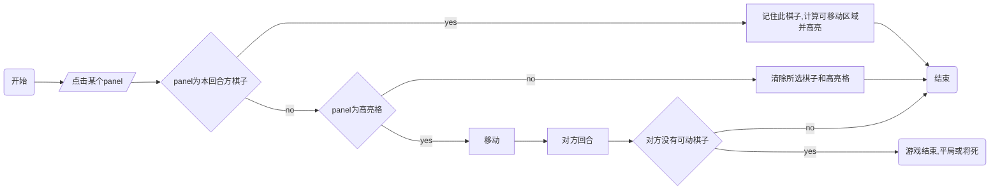
<center><strong>图 1  通过事件MouseClick 对程序主要流程的演示 </strong></center>


## 演示

<center>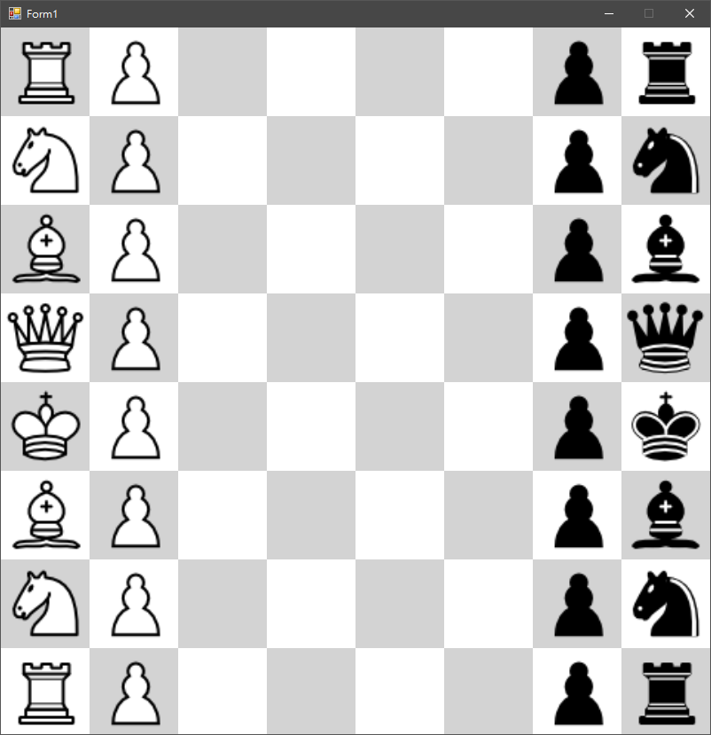</center>

<center><strong>图 4 进入游戏时的画面 </strong></center>

<center>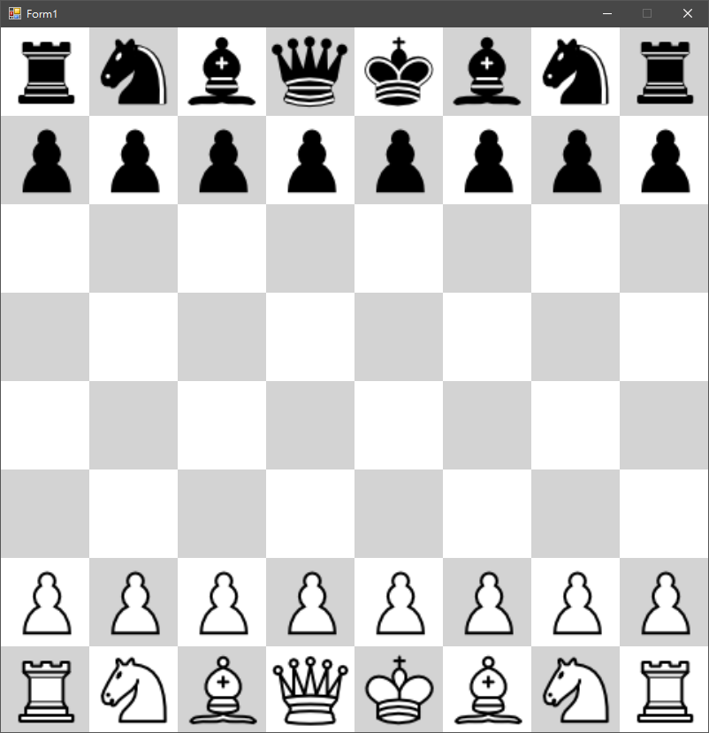</center>

<center><strong>图 5 利用滚轮旋转界面 </strong></center>

<center>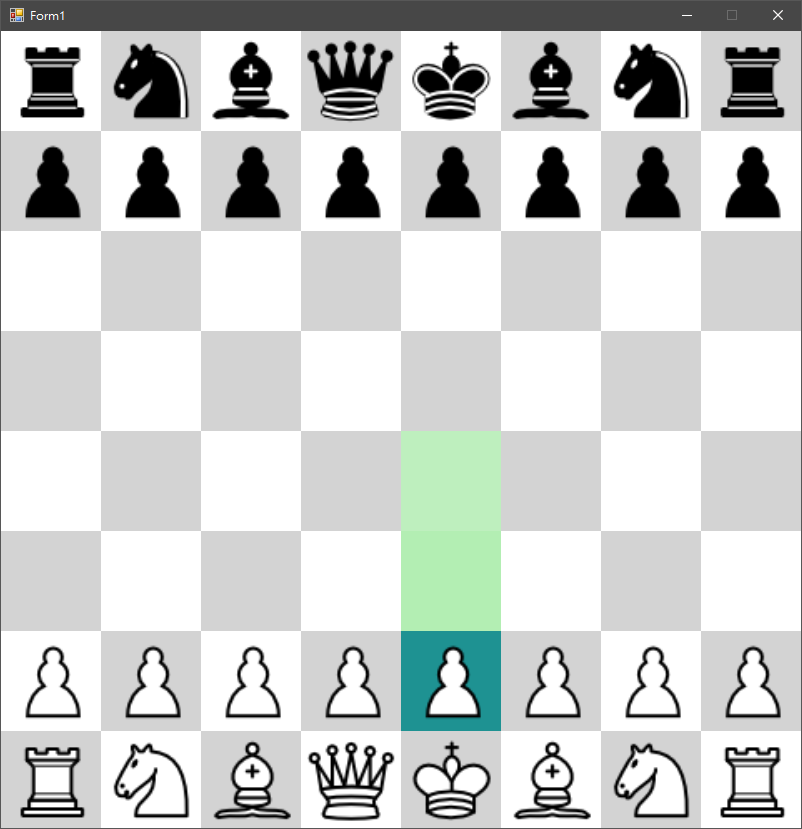</center>

<center><strong>图 6 选择棋子，显示可移动区域 </strong></center>

<center>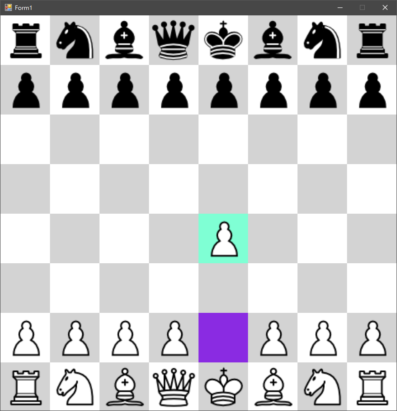</center>

<center><strong>图 7 移动完成 </strong></center>

<center>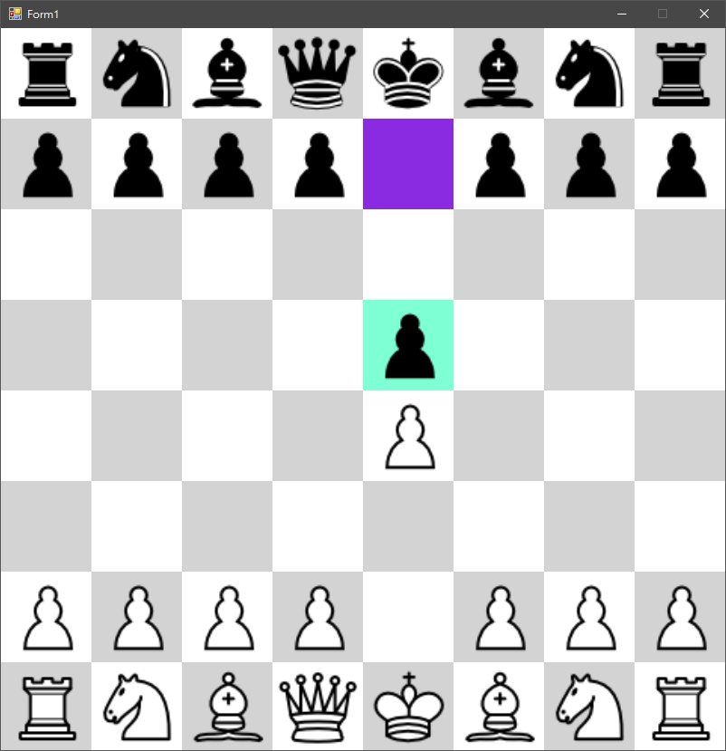</center>

<center><strong>图 8 黑方行动，同样的操作 </strong></center>

<center>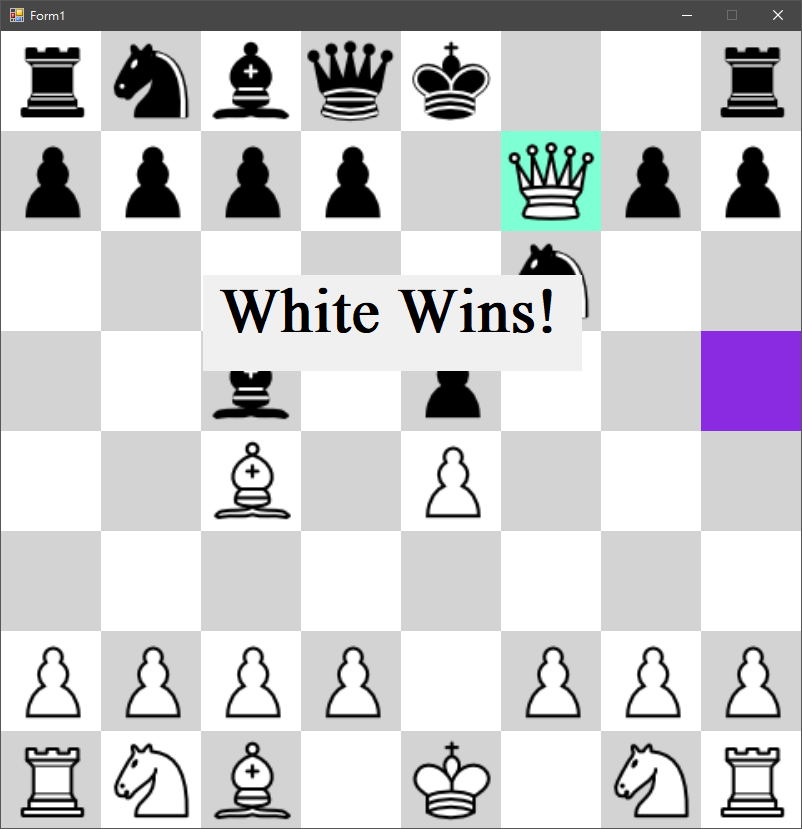</center>

<center><strong>图 9 Checkmate </strong></center>

<center>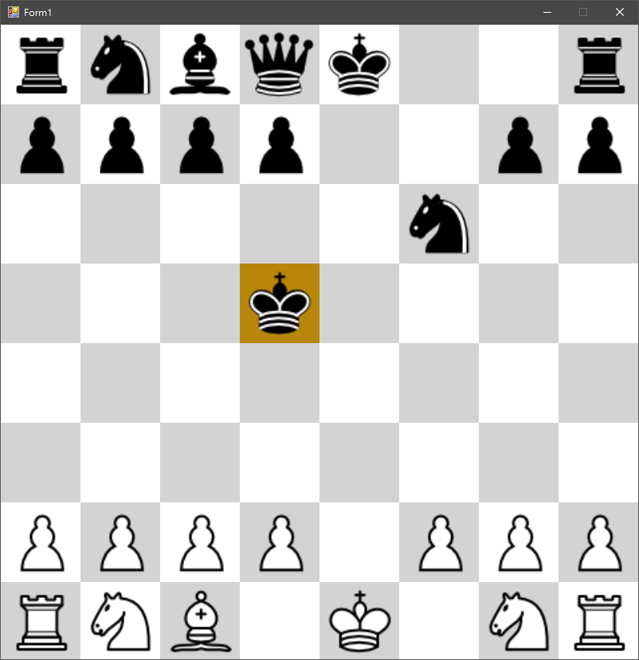</center>

<center><strong>图 10 连击5下空格 你可以作弊 甚至加入新的国王！ </strong></center>

<center>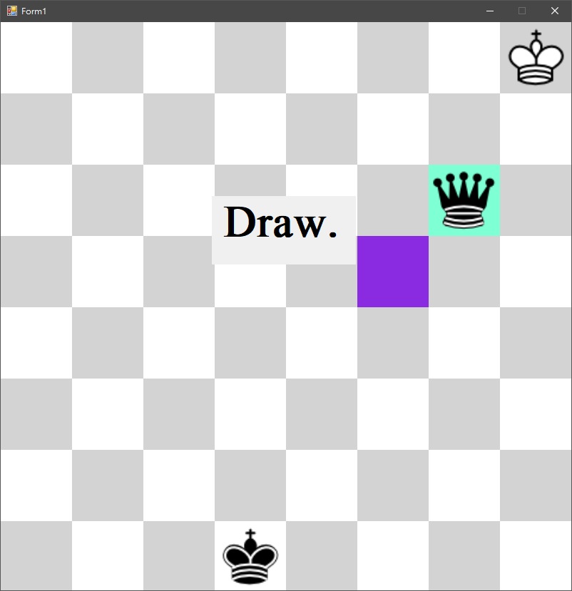</center>

<center><strong>图 11 臭棋导致平局 </strong></center>

<center>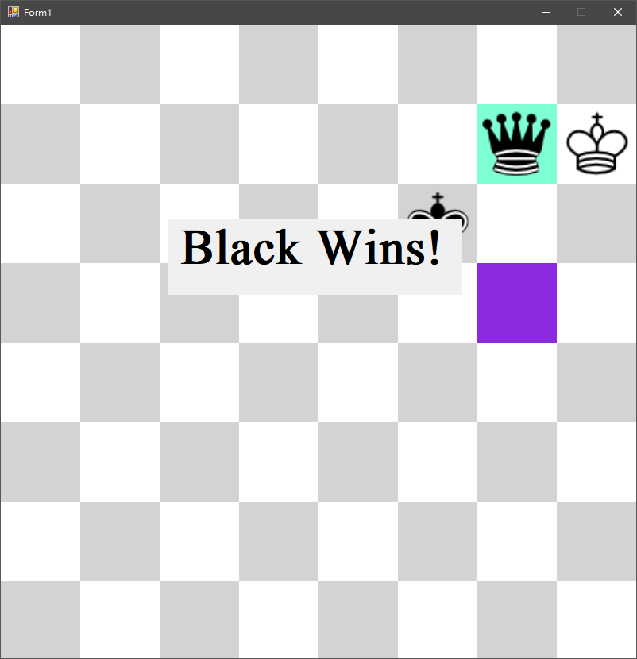</center>

<center><strong>图 12 这样下才对 </strong></center>

<center>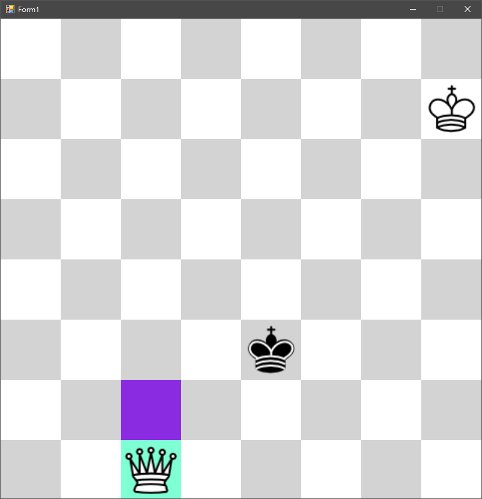</center>

<center><strong>图 13 升变 </strong></center>

<center>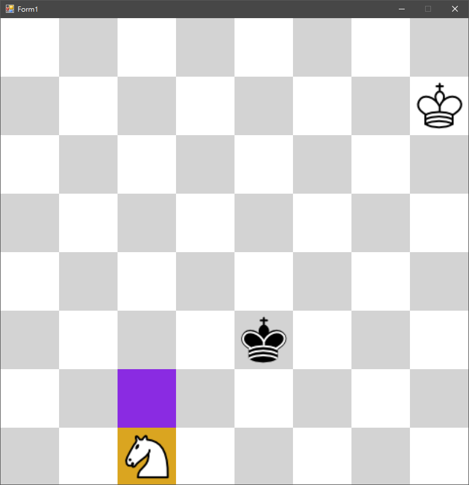</center>

<center><strong>图 14 升变可以选子 </strong></center>

<center>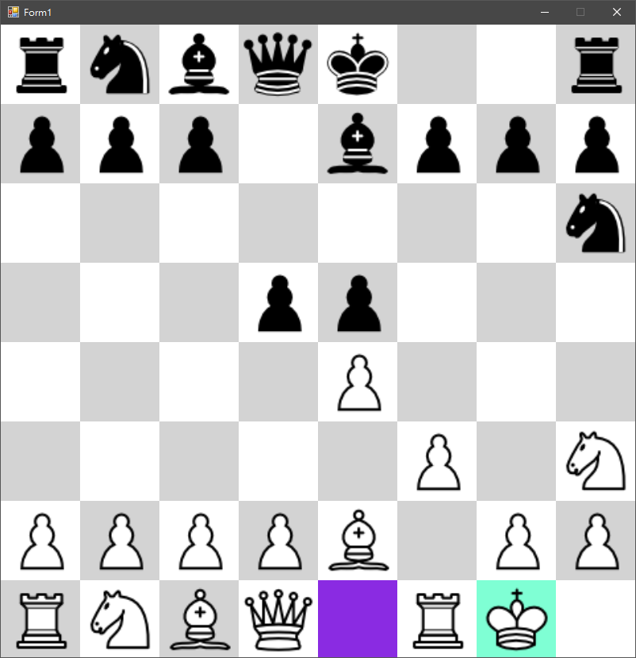</center>

<center><strong>图 15 短易位 </strong></center>

<center>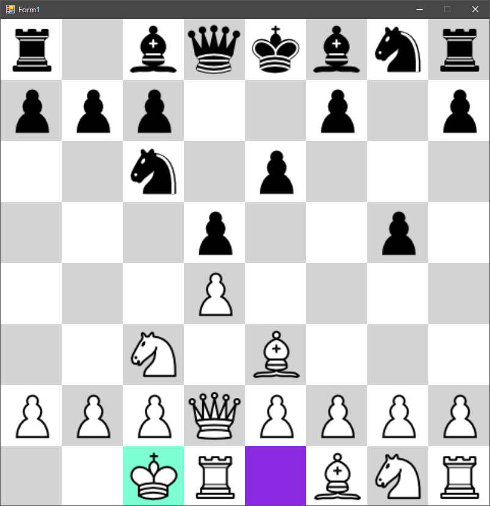</center>

<center><strong>图 16 长易位 </strong></center>

<center>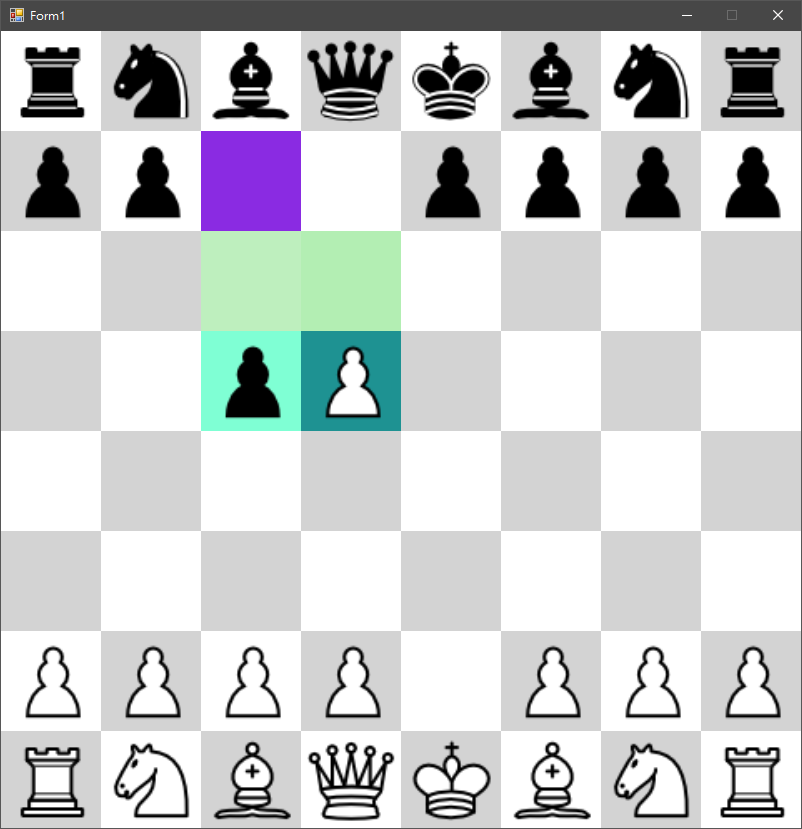</center>

<center><strong>图 17 吃过路兵（标绿，表示可以走这步。） </strong></center>